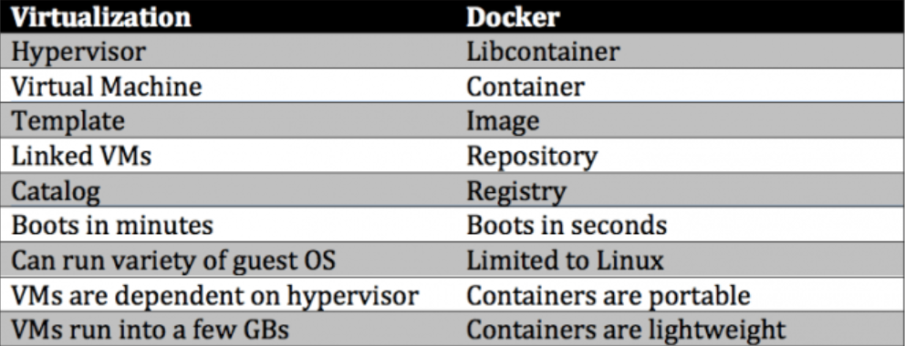
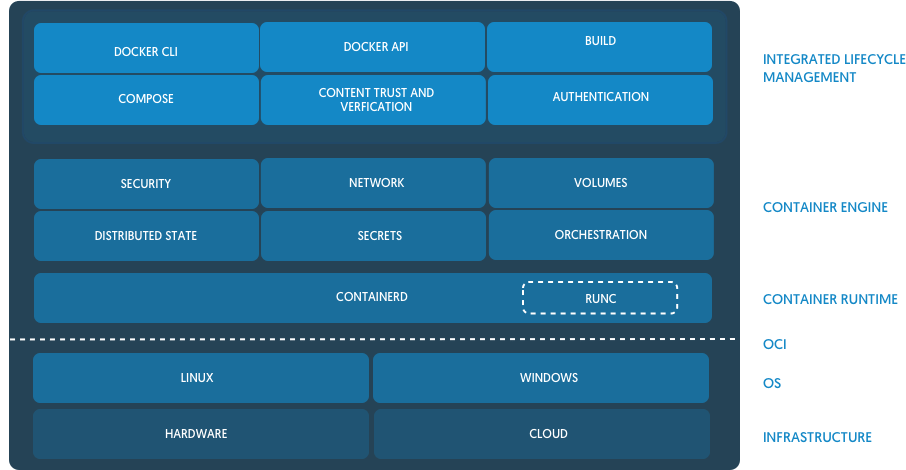
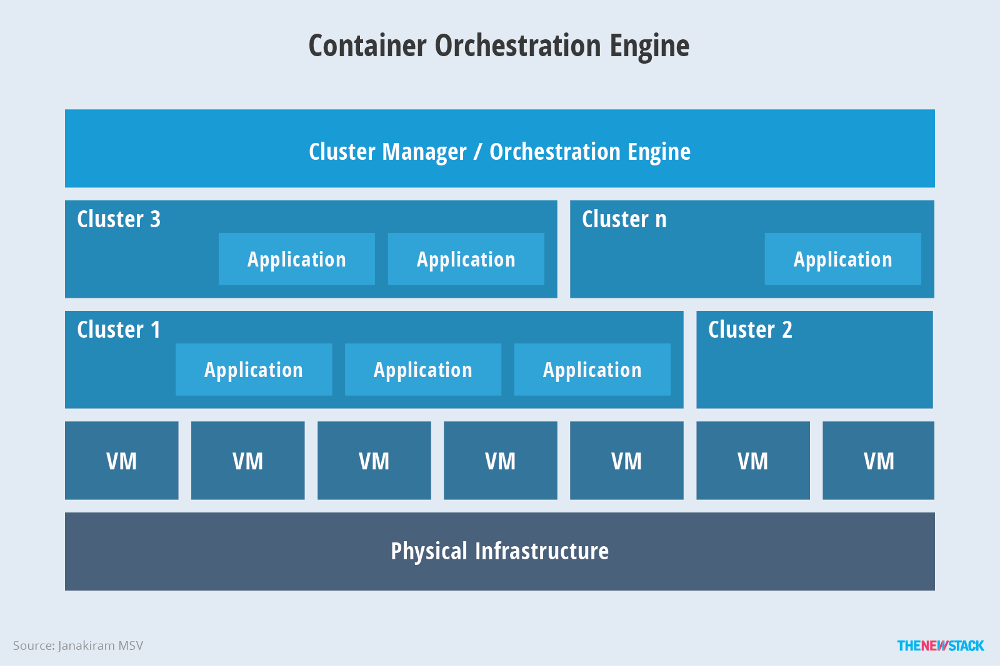

# What is containerization?
Containerization is type of virtualization, it relays on the host kernel (linux) and some of his core features.
Containers are implemented using Linux namespaces and cgroups. Namespaces let you virtualize system resources, like the file system or networking, for each container. Cgroups provide a way to limit the amount of resources like CPU and memory that each container can use. At the lowest level, container runtimes are responsible for setting up these namespaces and cgroups for containers, and then running commands inside those namespaces and cgroups. Low-level runtimes support using these operating system features.

# Containerization / Virtualization:
While _containerization_ relays on the kernel from the host _virtualization_ relays on a hypervisor.
A hypervisor or virtual machine monitor (VMM) is computer software, firmware or hardware that creates and runs virtual machines. A computer on which a hypervisor runs one or more virtual machines is called a host machine, and each virtual machine is called a guest machine.
VMs typically emulate x86 system. They share the hardware of the host machine.

# What is Docker?
- A container image format
- A method for building container images (Dockerfile/docker build)
- A way to manage container images (docker images, docker rm , etc.)
- A way to manage instances of containers (docker ps, docker rm , etc.)
- A way to share container images (docker push/pull)
- A way to run containers (docker run)

Here is a zoom in of the previous diagram.

# What is a containerization orchestration tool?
Container orchestration tools (Kubernetes, ECS, Docker Swarm, etc.) provide an efficient model for packaging, deployment, isolation, service discovery, scaling and rolling upgrades. Most mainstream PaaS solutions have embraced containers, and there are new PaaS implementations that are built on top of container orchestration and management platforms. Customers have the choice of either deploying core container orchestration tools that are more aligned with IT operations, or a PaaS implementation that targets developers.

# Links
- [Docker Vs Virtualization](https://cloudacademy.com/blog/docker-vs-virtualization/)
- [Hypervisor](https://en.wikipedia.org/wiki/Hypervisor)
- [Linux namespaces](https://en.wikipedia.org/wiki/Linux_namespaces)
- [Cgroups](https://en.wikipedia.org/wiki/Cgroups)
- [Container runtimes](https://www.ianlewis.org/en/container-runtimes-part-1-introduction-container-r)
- [Containerd](https://blog.docker.com/2017/08/what-is-containerd-runtime/)
- [Dokcer Swarm](https://docs.docker.com/engine/swarm)
- [Amazon ECS](https://aws.amazon.com/ecs/)
- [Kubernetes](https://kubernetes.io/)
- [Kubernetes an overview](https://thenewstack.io/kubernetes-an-overview/)
